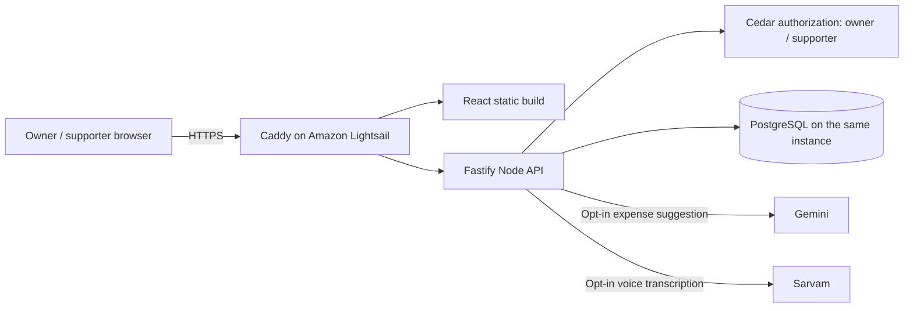
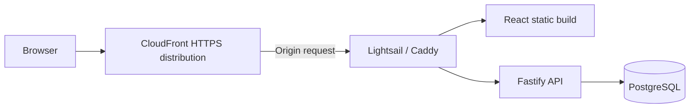
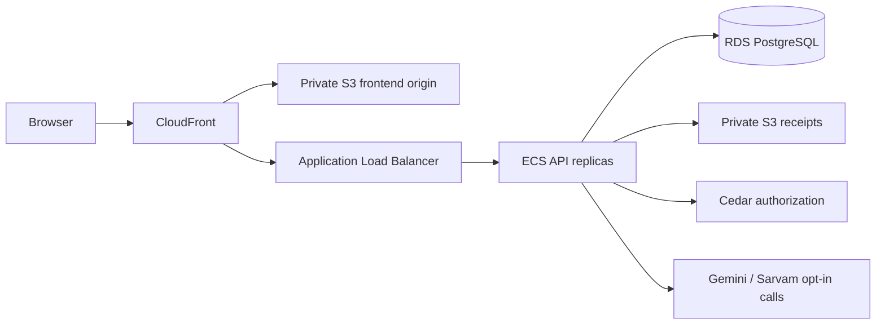

# Pocket Pact: the architecture we actually ship

The application has a presentation layer, API layer and persistent data layer. To keep the hackathon inexpensive, Caddy, the API and database share one 1 GB Lightsail instance in Mumbai. Caddy supplies HTTPS using an automatically renewed Let's Encrypt certificate. API responses and private photos are never cached. The Node API listens only on loopback.

**Build It:** AWS open-source Cedar runs in the Node process through `@cedar-policy/cedar-wasm`. It authorizes expense writes, contributions, acknowledgements, pact changes and uploads from the authenticated session's role and wallet. Default is deny. Zod and deterministic domain rules separately validate amounts, budgets and mutual approval. AI suggestions never authorize spending.

**Ship It:** Amazon Lightsail for compute and persistent disk; Caddy terminates HTTPS. systemd restarts the API on failure. Secrets stay in a root-deployed environment file readable only by the app's OS user. Cookies are HttpOnly, Secure and SameSite=Lax. Images are normalized and served through authenticated endpoints.

**Cost:** Lightsail `micro_3_1` is $7/month in Mumbai, approximately $1.61 for seven days (168 / 730 hours), before applicable credits. Its bundle includes public IPv4, SSD and a transfer allowance. The static IP remains attached. CloudFront creation was rejected pending AWS account verification, so it is not deployed and incurs no project charge. This is an estimate, not a billing hard cap. We avoid RDS, NAT Gateway, load balancers and Kubernetes at this scale. The API caps all-instance AI calls daily at 100 Gemini requests and 30 Sarvam requests; manual entry continues after that. External provider charges are separate from AWS.

**Tradeoff:** a single server is economical, but not highly available. The public hostname uses sslip.io DNS; a production release should use an owned domain. For real growth, keep the React/API contracts and migrate to S3 + CloudFront, ECS/App Runner, managed PostgreSQL and private S3 attachments. Those are future options, not services claimed in the current deployment.

## Planned CloudFront front door

This is the intended small-instance architecture once the AWS account is verified for CloudFront. Today the browser connects to Caddy directly at the live URL above.

## At scale (future design)

Separate static delivery, stateless API replicas, managed database and private receipt storage when traffic and uptime requirements justify the additional cost. This is a capacity plan, not a claim about deployed services.

References: [Lightsail pricing](https://aws.amazon.com/lightsail/pricing/), [CloudFront pricing](https://aws.amazon.com/cloudfront/pricing/), [Cedar source](https://github.com/cedar-policy/cedar), [hackathon tracks](https://www.wemakedevs.org/aws/first-commit).
